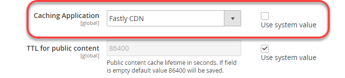

# Konfigurera snabbfunktioner

Det krävs snabbt för Adobe Commerce i miljöer med molnbaserad infrastruktur, staging och produktion.

Fungerar snabbt med Varnish för att tillhandahålla snabba cachningsfunktioner och en [Content Delivery Network](https://glossary.magento.com/content-delivery-network) (CDN) för statiska resurser. Tillhandahåller snabbt även en Brandvägg för webbaserade program (WAF) för att säkra din webbplats och molninfrastrukturen. För att skydda din webbplats och molninfrastruktur från skadlig trafik och attacker dirigerar du all inkommande webbplatstrafik via Fast.

>[!NOTE]
>
>Snabb är inte tillgängligt i integreringsmiljöer.

Följ de här stegen för att aktivera, konfigurera och testa snabbt i webbplatsutvecklingsprocessen för att ge säker åtkomst till din webbplats.

- Få snabbt inloggningsuppgifter för mellanlagrings- och produktionsmiljöer
- Aktivera snabb CDN-cachelagring
- Ladda upp VCL-fragment snabbt
- Uppdatera DNS-konfigurationen för att dirigera trafik till tjänsten Snabbt
- Testa cachelagring snabbt

>[!NOTE]
>
>När du har aktiverat och verifierat den ursprungliga snabbkonfigurationen kan du anpassa konfigurationen. Du kan till exempel aktivera ytterligare alternativ som bildoptimering, kantmoduler och anpassad VCL-kod. Se [Anpassa cachekonfigurationen](fastly-custom-cache-configuration.md).

## Få inloggningsuppgifter snabbt

Under etableringen lägger Adobe till ditt projekt i [Snabb service](fastly.md#fastly-service-account-and-credentials) för Adobe Commerce i molninfrastrukturen och skapar kontoautentiseringsuppgifter för Fast för Starter `master` och Pro Staging- och Production-miljöer. Varje miljö har unika referenser.

Du behöver snabbinloggningsuppgifterna för att kunna konfigurera Fast CDN-tjänster från administratören och skicka in Fast API-begäranden.

>[!NOTE]
>
>Med Adobe Commerce i molninfrastruktur har du inte tillgång till Snabbadministratör direkt. Använd administratören för att granska och uppdatera snabbkonfigurationen för dina miljöer. Om du inte kan lösa ett problem med hjälp av snabbfunktionerna i Admin skickar du in en [Adobe Commerce Support](https://experienceleague.adobe.com/docs/commerce-knowledge-base/kb/help-center-guide/magento-help-center-user-guide.html#submit-ticket).

Använd följande metoder för att hitta och spara snabb service-ID och API-token för din miljö:

**Visa dina inloggningsuppgifter snabbt**:

Metoden för att visa inloggningsuppgifter skiljer sig åt för Pro- och Starter-projekt.

- IaaS-monterad delad katalog - I Pro-projekt använder du SSH för att ansluta till servern och få de snabba inloggningsuppgifterna från `/mnt/shared/fastly_tokens.txt` -fil. För mellanlagrings- och produktionsmiljöer finns unika autentiseringsuppgifter. Du måste hämta autentiseringsuppgifterna för varje miljö.

- Lokal arbetsyta - Från kommandoraden använder du `magento-cloud` CLI till [lista och granskning](../environment/variables-cloud.md#viewing-environment-variables) Snabba miljövariabler.

  ```bash
  magento-cloud variable:get -e <environment-ID>
  ```

- [!DNL Cloud Console]—Kontrollera följande miljövariabler i [Miljökonfiguration](../project/overview.md#configure-environment).

   - `CONFIG__DEFAULT__SYSTEM__FULL_PAGE_CACHE__FASTLY__FASTLY_API_KEY`

   - `CONFIG__DEFAULT__SYSTEM__FULL_PAGE_CACHE__FASTLY__FASTLY_SERVICE_ID`

>[!NOTE]
>
>Om du inte hittar de snabba autentiseringsuppgifterna för mellanlagrings- eller produktionsmiljöerna kontaktar du Adobe Customer Technical Advisor (CTA).

## Aktivera snabb cachelagring

Du behöver följande komponenter för att aktivera och konfigurera snabbfunktioner:

- Senaste versionen av [Snabbt CDN för modulen Magento 2](fastly.md#fastly-cdn-module-for-magento-2) installeras i miljö för förproduktion och produktion. Se [Uppgradera snabbt](#upgrade-the-fastly-module).

- [Autentiseringsuppgifter snabbt](#get-fastly-credentials) för Adobe Commerce i molnbaserade miljöer Staging and Production

**Aktivera snabb CDN-cachning i mellanlagring och produktion**:

{{admin-login-step}}

1. Klicka **Lager** > Inställningar > **Konfiguration** > **Avancerat** > **System** och expandera **Helsidescache**.

   

1. I _Cachelagring_ tar du bort markeringen från **Använd systemvärde** och sedan markera **Snabb CDN** i listrutan.

   

1. Expandera **Snabb konfiguration** och [välj cachealternativ](https://github.com/fastly/fastly-magento2/blob/master/Documentation/CONFIGURATION.md#configure-the-module).

1. När du har konfigurerat cachelagringsalternativen klickar du på **Spara konfiguration** överst på sidan.

1. Rensa cacheminnet enligt meddelandet.

1. Fortsätt konfigurera snabbt genom att gå tillbaka till **Lager** > **Inställningar** > **Konfiguration** > **Avancerat** > **System** > **Snabb konfiguration**.

### Testa autentiseringsuppgifter snabbt

1. Gå till Admin **Lager** > Inställningar > **Konfiguration** > **Avancerat** > **System** > **Snabb konfiguration**.

1. Lägg till **Snabb service-ID** och **API-token** värden för din projektmiljö.

   

   >[!NOTE]
   >
   >Välj inte länken för att skapa en API-token snabbt. Använd i stället [Autentiseringsuppgifter snabbt (Service ID och API-token) från Adobe](#get-fastly-credentials) tillhandahålls av Adobe.

1. Klicka **Testa autentiseringsuppgifter**.

1. Om testet lyckas klickar du på **Spara konfiguration** och rensa sedan cachen.

   Om testet misslyckas kontrollerar du att rätt Service ID- och API-tokenvärden matchar autentiseringsuppgifterna för den aktuella miljön.

   Om testet misslyckas igen skickar du en Adobe Commerce supportanmälan eller kontaktar din Adobe-kontorepresentant. För Pro-projekt ska du inkludera URL:er för dina produktions- och mellanlagringswebbplatser. Inkludera URL:er för dina Starter-projekt `Master` och mellanlagringsplats.

>[!NOTE]
>
>Instruktioner om hur du ändrar snabbt API-tokenreferenser för en mellanlagrings- eller produktionsmiljö finns i [Ändra snabbt autentiseringsuppgifter](fastly.md#change-fastly-api-token).

### Ladda upp VCL snabbt

När du har aktiverat modulen Snabbt överför du standardinställningen [VCL-kod](https://github.com/fastly/fastly-magento2/tree/master/etc/vcl_snippets) till snabbservrarna. Den här koden innehåller en serie VCL-kodfragment som anger konfigurationsinställningarna för att aktivera cachelagring och andra Fast CDN-tjänster för din Adobe Commerce i molninfrastruktur.

>[!NOTE]
>
>Tjänster för snabb cachning fungerar inte förrän du har slutfört den initiala överföringen av den Fast VCL-koden till Adobe Commerce Staging and Production.

**Så här överför du den snabba VCL-filen**:

1. I _Snabb konfiguration_ avsnitt, klicka **Ladda upp VCL snabbt** som bilden nedan visar.

   

1. När överföringen är klar uppdaterar du cacheminnet enligt meddelandet längst upp på sidan.

## Tillhandahåll SSL-/TLS-certifikat

Adobe tillhandahåller ett domänvaliderat SSL-/TLS-certifikat (Let&#39;s Encrypt SSL/TLS) för säker HTTPS-trafik snabbt. Adobe tillhandahåller ett certifikat för varje Pro Production-, Staging- och Starter Production-miljö för att skydda alla domäner i den miljön. Mer information om det certifikat du anger finns i [Adobe SSL-certifikat (TLS) för Adobe Commerce på molninfrastruktur](https://experienceleague.adobe.com/docs/commerce-knowledge-base/kb/how-to/ssl-tls-certificates-for-magento-commerce-cloud-faq.html).

>[!NOTE]
>
>Du kan ange ett eget TLS- eller SSL-certifikat i stället för att använda det krypteringscertifikat som medföljer Adobe. Den här processen kräver dock ytterligare arbete för att kunna konfigurera och underhålla. Om du vill välja det här alternativet skickar du en Adobe Commerce supportanmälan eller arbetar med Adobe för att lägga till anpassade värdbaserade certifikat till din Adobe Commerce i molninfrastrukturmiljöer.

Om du vill aktivera SSL-/TLS-certifikaten för Adobe Commerce-miljöer utför Adobe-automatisering följande steg:

- Validerar domänägarskap
- Tillhandahåller ett Let&#39;s Encrypt SSL/TLS-certifikat som omfattar angivna övre nivåer och underdomäner för dina butiker
- Överför certifikatet till molnmiljön när webbplatsen är aktiv

Den här automatiseringen kräver att du uppdaterar DNS-konfigurationen för din plats för att kunna tillhandahålla domänverifieringsinformation. Använd **en** av följande metoder:

- **DNS-validering**-För publicerade webbplatser ska du uppdatera din DNS-konfiguration med CNAME-poster som pekar på tjänsten Snabbt
- **ACME-utmaning - CNAME-poster**-Uppdatera din DNS-konfiguration med ACME-utmanings-CNAME-poster som tillhandahålls av Adobe för varje domän i din miljö

>[!TIP]
>
>Om du har en produktionsdomän som inte är aktiv använder du ACME-utmanings-CNAME-posterna för domänvalidering. Om du lägger till posterna i DNS-konfigurationen tidigt kan Adobe etablera SSL-/TLS-certifikatet med rätt domäner innan webbplatsen startas. Innan du startar till produktionen måste du ersätta platshållarposterna med CNAME-posterna från Adobe.

När domänvalideringen är klar tillhandahåller Adobe certifikatet för kryptering av TLS/SSL och överför det till miljöer med aktiv förproduktion eller produktion. Den här processen kan ta upp till 12 timmar. Vi rekommenderar att du slutför DNS-konfigurationsuppdateringarna flera dagar i förväg för att undvika förseningar i webbplatsutvecklingen och webbplatsens start.

## Uppdatera DNS-konfiguration med utvecklingsinställningar

Under den första snabbinstallationsprocessen kan du använda följande URL:er för att konfigurera och testa Snabb cachelagring i mellanlagrings- och produktionsmiljöer:

- Proffsens produktion:

   - `mcprod.<your-domain>.com`
   - `mcstaging.<your-domain>.com`

- Endast för startproduktion:

   - `mcprod.<your-domain>.com`

Dessa standardförproduktionsadresser är tillgängliga när projektet har etablerats. Värdet för `"your-domain"` är det domännamn du angav under introduktionsprocessen.

>[!NOTE]
>
>Du kan inte ange en anpassad domän för en icke-produktionsmiljö i Starter-projekt.

Uppdatera din DNS-konfiguration om du vill dirigera trafik från dina webbutiks-URL:er till tjänsten Snabbt. När du uppdaterar konfigurationen etablerar Adobe automatiskt de SSL-/TLS-certifikat som krävs och överför dem till dina molnmiljöer. Den här provisioneringen kan ta upp till 12 timmar.

>[!NOTE]
>
>När du är redo att starta din produktionsplats måste du uppdatera DNS-konfigurationen igen så att den pekar på produktionsdomänerna mot tjänsten Snabbt och slutföra ytterligare konfigurationsåtgärder. Se [Öppna checklista](../launch/checklist.md).

**Förutsättningar:**

- Aktivera modulen Snabbt.
- Ladda upp standardkoden för VCL snabbt.
- Ange en lista över de översta domänerna och underdomänerna för varje miljö till Adobe, eller skicka en Adobe Commerce supportanmälan.
- Vänta på bekräftelse på att de angivna domänerna har lagts till i dina molnmiljöer.
- I Starter-projekt lägger du till domänerna i din snabbtjänstkonfiguration. Se [Hantera domäner](fastly-custom-cache-configuration.md#manage-domains).
- Mer information om hur du uppdaterar DNS-konfigurationen finns i [DNS-registrator](https://lookup.icann.org/) för att hitta rätt metod för domäntjänsten.

**Så här uppdaterar du DNS-konfigurationen för utveckling**:

1. Poäng för förproduktion av URL:er till tjänsten Snabb genom att lägga till CNAME-poster: `prod.magentocloud.map.fastly.net`, till exempel:

   | Domän eller underdomän | CNAME |
   |---------------------------|----------------------------------|
   | mcprod.your-domain.com | prod.magentocloud.map.fastly.net |
   | mcstaging.your-domain.com | prod.magentocloud.map.fastly.net |

   När CNAME-posterna är live tillhandahåller Adobe certifikat och överför SSL-/TLS-certifikaten.

   >[!NOTE]
   >
   >Om du tänker använda en domän (`your-domain.com`) för produktionsplatsen måste du konfigurera DNS-adressposter (A-poster) så att de pekar på IP-adresserna för snabbservern. Se [Uppdatera DNS-konfiguration med produktionsinställningar](../launch/checklist.md#to-update-dns-configuration-for-site-launch).


1. Lägg till ACME-utmanings-CNAME-poster för domänvalidering och företablering av Production SSL/TLS-certifikat, till exempel:

   | Domän eller underdomän | CNAME |
   |-------------------------------------------|-------------------------------------------|
   | _acme-challenge.your-domain.com | 0123456789abcdef.validation.magento.cloud |
   | _acme-challenge.www.your-domain.com | 9573186429stuvwx.validation.magento.com |
   | _acme-challenge.mystore.your-domain.com | 1234567898zxywvu.validation.magento.cloud |
   | _acme-challenge.subdomain.your-domain.com | 1098765743lmnopq.validation.magento.cloud |

   >[!NOTE]
   >
   >ACME-utmaningsposterna i det här exemplet är platshållare som inte är avsedda att tillhandahålla dina Adobe Commerce mellanlagrings- och produktionsplatser. Kontakta Adobe för att få rätt information om ACME-utmaningsposten för ditt projekt.

   När du har lagt till CNAME-posterna validerar Adobe domänerna och tillhandahåller SSL-/TLS-certifikatet för miljön. När du uppdaterar DNS-konfigurationen för att dirigera trafik från dessa domäner till tjänsten Snabbt, överför Adobe certifikatet till miljön.

1. Uppdatera Adobe Commerce Bas-URL.

   - Använd SSH för att logga in i produktionsmiljön.

     ```bash
     magento-cloud ssh
     ```

   - Använd CLI i molnet för att ändra bas-URL:en för din butik.

     ```bash
     php bin/magento setup:store-config:set --base-url="https://mcstaging.your-domain.com/"
     ```

   >[!NOTE]
   >
   >Som ett alternativ till molnbaserad CLI kan du uppdatera bas-URL:en från [Administratör](https://experienceleague.adobe.com/docs/commerce-admin/stores-sales/site-store/store-urls.html)

1. Starta om webbläsaren.

1. Testa webbplatsen.

## Testa cachelagring snabbt

När du är klar med ändringarna av DNS-konfigurationen använder du [cURL](https://curl.se/) kommandoradsverktyget för att verifiera att snabbcachen fungerar.

**Kontrollera svarshuvuden**:

1. Använd följande i en terminal: `curl` för att testa din webbplats-URL:

   ```bash
   curl -vo /dev/null -H Fastly-Debug:1 https://<live-URL>
   ```

   Använd kommandot `--resolve` som åsidosätter DNS-namnmatchning.

   ```bash
   curl -vo /dev/null -H Fastly-Debug:1 --resolve <live-URL-hostname>:443:<live-IP-address>
   ```

1. I svaret kontrollerar du att [rubriker](fastly-troubleshooting.md#check-cache-hit-and-miss-response-headers) för att säkerställa att Fastly fungerar. Du bör se följande unika rubriker i svaret:

   ```http
   < Fastly-Magento-VCL-Uploaded: yes
   < X-Cache: HIT, MISS
   ```

Om rubrikerna inte har rätt värden läser du [Åtgärda fel i svarshuvuden](fastly-troubleshooting.md#curl) för felsökningshjälp.

## Uppgradera modulen Snabbt

Uppdaterar snabbt CDN för Magento 2-modulen för att lösa problem, öka prestandan och tillhandahålla nya funktioner.
Vi rekommenderar att du uppdaterar modulen Snabbt i dina miljö för stapling och produktion till [senaste versionen](https://github.com/fastly/fastly-magento2/blob/master/VERSION).

När du har uppdaterat modulen måste du överföra VCL-koden för att ändringarna ska gälla för snabbtjänstkonfigurationen.

>[!WARNING]
>
> Om du har anpassat standardkoden för Fast VCL med en anpassad version skrivs ändringarna över när du uppgraderar modulen Snabbt. Om du har lagt till anpassade VCL-fragment med unika namn bevaras dessa ändringar under uppgraderingsprocessen. Som en god praxis bör du uppgradera mellanlagringsmiljön och validera ändringarna innan du tillämpar ändringarna i produktionsmiljön.

**Så här kontrollerar du vilken version av Fast CDN-modulen som används för Magento 2**:

1. Byt till rotkatalogen i molnmiljön.

1. Använd Composer för att kontrollera den installerade versionen.

   ```bash
   composer show *fastly*
   ```

1. Om [senaste versionen](https://github.com/fastly/fastly-magento2/releases) är inte installerat, slutför stegen för att uppgradera modulen Snabbt.

**Så här uppgraderar du modulen Snabbt**:

1. I den lokala integreringsmiljön använder du följande modulinformation för att [uppgradera snabbmodulen](../store/extensions.md#upgrade-an-extension).

   ```text
   module name: fastly/magento2
   repository: https://github.com/fastly/fastly-magento2.git
   ```

1. Skicka dina uppdateringar till mellanlagringsmiljön.

1. Logga in i Admin for your Staging environment på [ladda upp VCL-koden](#upload-vcl-to-fastly).

1. [Verifiera snabbt tjänster](fastly-troubleshooting.md#verify-or-debug-fastly-services) på webbplatsen Adobe Commerce Staging.

När du har verifierat Snabba tjänster på mellanlagringsplatsen upprepar du uppgraderingsprocessen i produktionsmiljön.

>[!TIP]
>
> Om du har problem med Fastly-tjänsterna i dina Adobe Commerce-miljöer kan du läsa [Adobe Commerce snabbfelsökare](https://experienceleague.adobe.com/docs/commerce-knowledge-base/kb/troubleshooting/miscellaneous/magento-fastly-troubleshooter.html).
